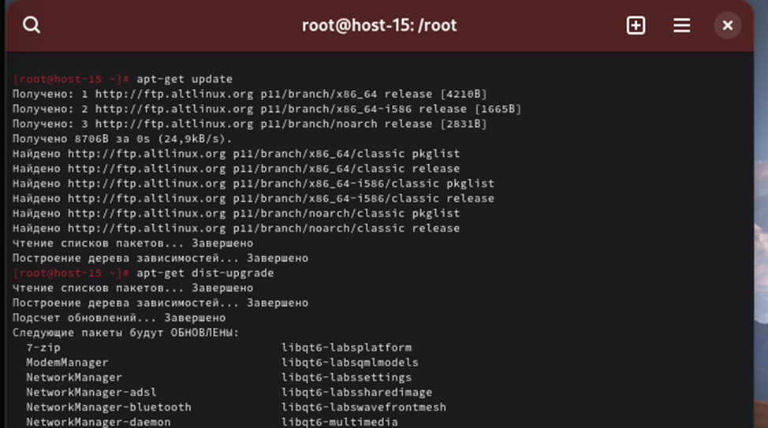
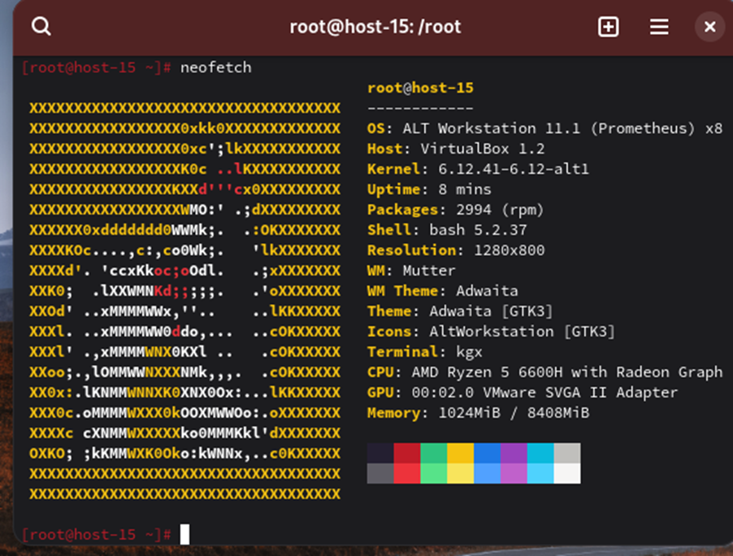
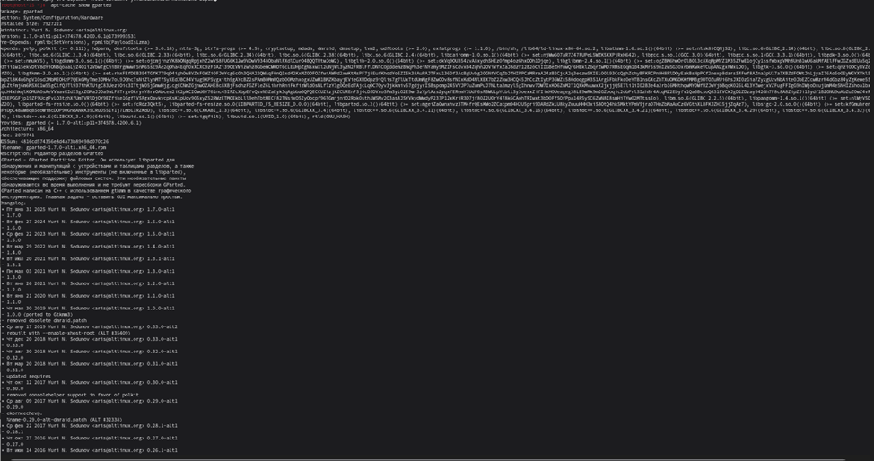

# Отчет по лабораторной работе №5  
**Управление программным обеспечением**

---

## Цель работы
Получить практические навыки по установке/удалению программного обеспечения в ОС "Альт".

## Исходные данные
- Персональный компьютер/ноутбук (ЦП с поддержкой виртуализации, 8 ГБ ОЗУ, 100 ГБ свободного места на диске).
- Установленное ПО VirtualBox.
- Виртуальная машина «Альт Рабочая станция».

## Ход выполнения работы

### 1. Обновление системы до актуального состояния
Выполнены команды:
```bash
su -
apt-get update
apt-get dist-upgrade
```
Система успешно обновлена.



### 2. Установка приложения `neofetch`
Выполнена команда:
```bash
apt-get install neofetch
```
Приложение установлено.

### 3. Запуск `neofetch`
Выполнена команда:
```bash
neofetch
```
На экране отображена информация о системе.

### 4. Удаление `neofetch`
Выполнена команда:
```bash
apt-get remove neofetch
```
Приложение удалено.

### 5. Загрузка RPM-пакета Google Chrome
С использованием браузера Firefox с официального сайта Google Chrome скачан RPM-пакет.  
Файл сохранён в каталог `/home/user/Загрузки`.

### 6. Установка Google Chrome
Выполнена команда:
```bash
rpm -i /home/user/Загрузки/google-chrome-stable_current_x86_64.rpm
```
При установке возникли ошибки, которые были проигнорированы.  
Для автозавершения команд использовалась клавиша `TAB`.

### 7. Проверка установки пакета
Выполнена команда:
```bash
rpm -qa | grep chrome
```
Пакет `google-chrome-stable` присутствует в списке установленных.

### 8. Запуск Google Chrome
Запуск выполнен через меню: **Меню → Интернет → Google Chrome**.

### 9. Удаление Google Chrome
Выполнена команда:
```bash
rpm -e google-chrome-stable
```
Приложение удалено.

### 10. Поиск пакета `gparted`
Выполнена команда:
```bash
apt-cache search gparted
```
Найдены пакеты, связанные с `gparted`.

### 11. Получение информации о пакете `gparted`
Выполнена команда:
```bash
apt-cache show gparted
```
Выведена подробная информация о пакете.

### 12. Установка AnyDesk через `epm`
Выполнена команда:
```bash
epm play anydesk
```
AnyDesk успешно установлен.

### 13. Проверка появления AnyDesk в меню
Пункт **AnyDesk** появился в меню приложений.

### 14. Завершение работы
Работа завершена.

---

## Вывод
В ходе лабораторной работы по управлению программным обеспечением в операционной системе «Альт» были изучены методы установки, обновления и удаления программ. Это позволяет поддерживать систему в актуальном состоянии и обеспечивать необходимый набор приложений для пользователей.