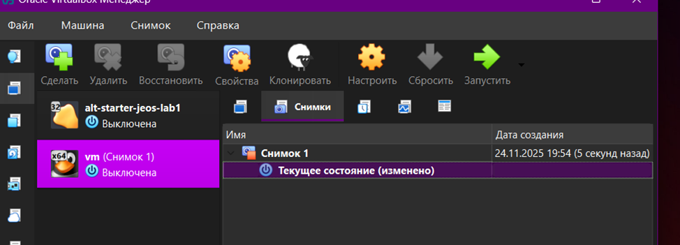
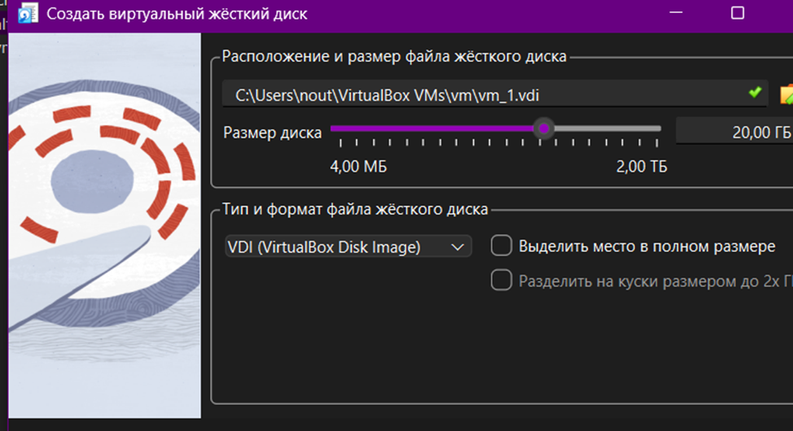
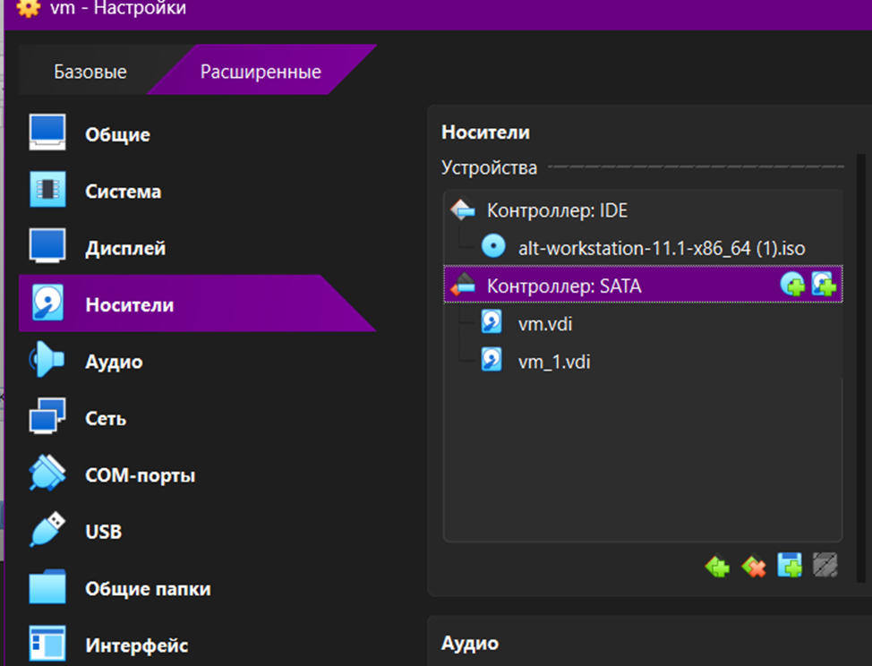
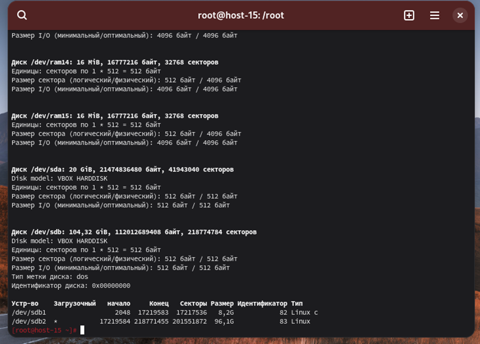
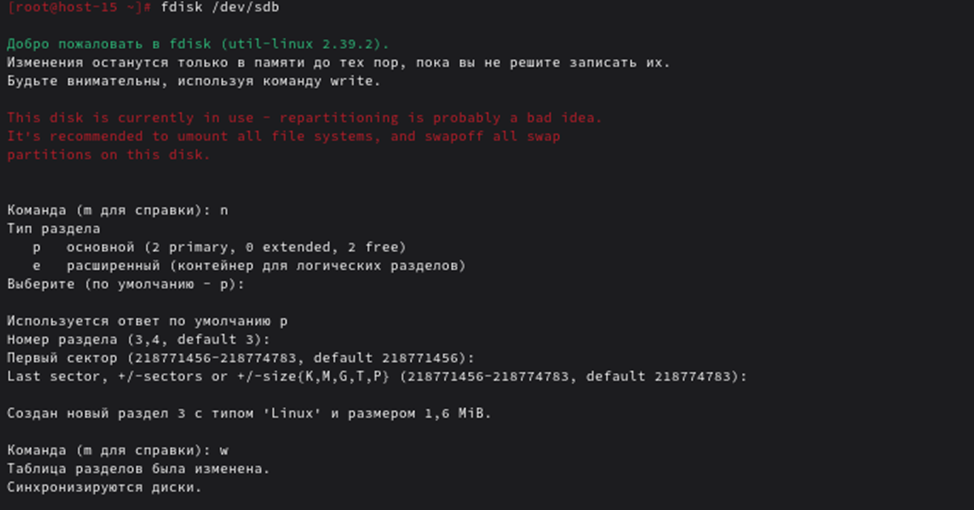
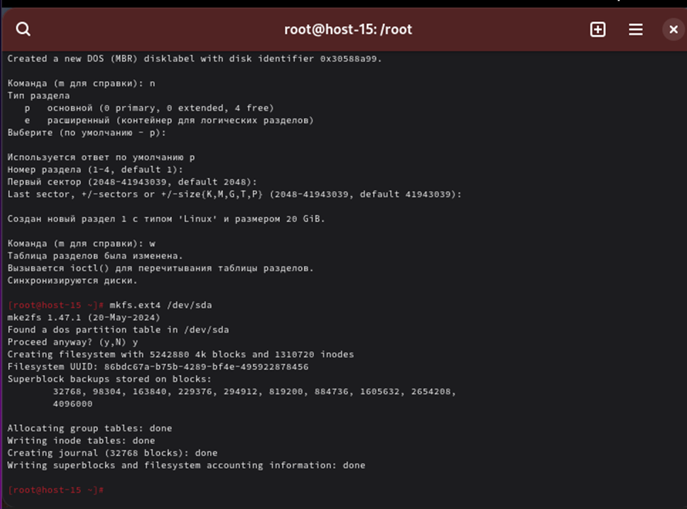
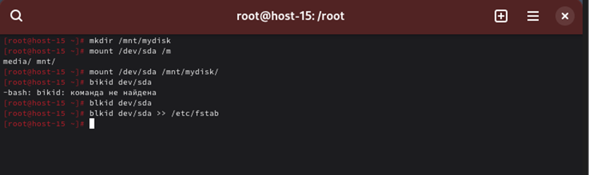
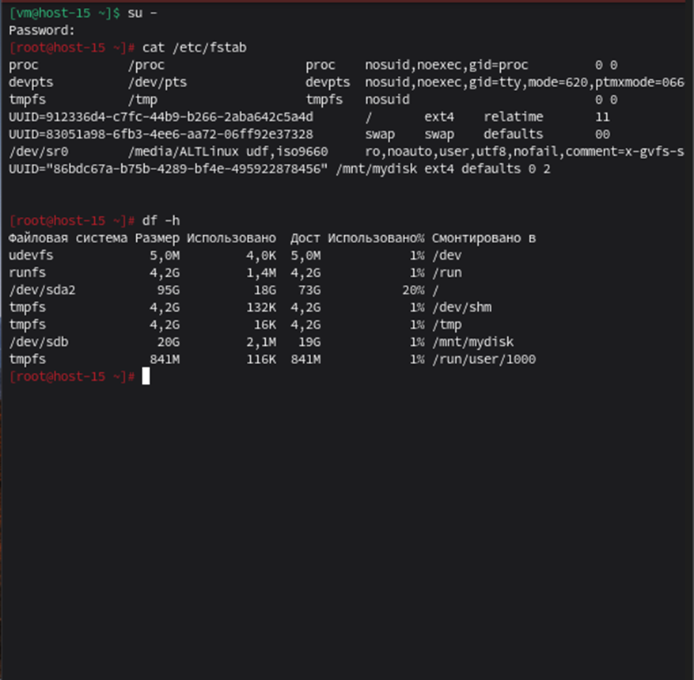

# Отчет по лабораторной работе №6  
**Работа с разделами, дисками и файловыми системами**

---

## Цель работы
Ознакомление с процессом монтирования дисков в ОС «Альт», создание разделов с помощью fdisk, использование UUID для монтирования разделов в файле `/etc/fstab`.

## Исходные данные
- Персональный компьютер/ноутбук (ЦП с поддержкой виртуализации, 8 ГБ ОЗУ, 100 ГБ свободного места на диске).
- Установленное ПО VirtualBox.
- Виртуальная машина «Альт Рабочая станция».

## Ход выполнения работы

### 1. Создание снимка системы
Перед началом работы создан снимок системы в VirtualBox.



### 2-4. Добавление виртуального жесткого диска
В настройках виртуальной машины VirtualBox добавлен новый виртуальный жесткий диск.  
Параметры оставлены по умолчанию:
- Тип файла: VDI
- Формат хранения: Динамический виртуальный жесткий диск
- Размер: 20 ГБ

Диск подключен к машине.


### 5. Просмотр информации о дисках
```bash
fdisk -l
```
Просмотрены все доступные диски в системе.

### 6. Запуск утилиты fdisk
```bash
fdisk /dev/sdb
```
Открыта утилита для работы с добавленным диском.

### 7. Создание нового раздела
В интерфейсе `fdisk` выполнены команды:
1. `n` - создание нового раздела
2. `p` - выбор первичного раздела
3. `Enter` - принятие значений по умолчанию (номер раздела, секторы)
4. `w` - сохранение изменений и выход

Создан раздел `/dev/sdb1`.

### 8. Создание файловой системы
```bash
mkfs.ext4 /dev/sdb1
```
На созданном разделе создана файловая система ext4.

### 9. Создание точки монтирования
```bash
mkdir /mnt/mydisk
```
Создана директория для монтирования.

### 10. Монтирование раздела
```bash
mount /dev/sdb1 /mnt/mydisk
```
Раздел смонтирован в созданную точку.

### 11. Определение UUID раздела
```bash
blkid /dev/sdb1
```
Получен UUID раздела для использования в fstab.

### 12-14. Настройка автоматического монтирования
Добавлена строка в файл `/etc/fstab`:
```
UUID=<полученный_UUID> /mnt/mydisk ext4 defaults 0 2
```

### 15. Сохранение изменений
Изменения сохранены в файле `/etc/fstab`.

### 16. Проверка автоматического монтирования
После перезагрузки системы выполнена команда:
```bash
df -h
```
Раздел `/dev/sdb1` автоматически смонтирован в `/mnt/mydisk`.

### 17. Завершение работы
Работа завершена.

---

## Вывод
Лабораторная работа по работе с разделами, дисками и файловыми системами в операционной системе «Альт» подчеркнула важность грамотного управления хранилищем данных. Знание процессов создания, изменения и монтирования разделов позволяет эффективно организовывать пространство хранения и обеспечивать надежность работы системы.