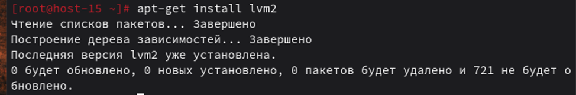
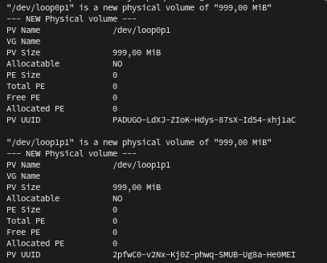
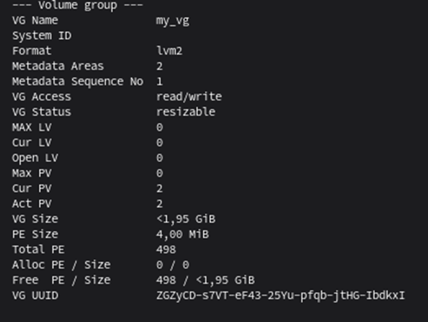
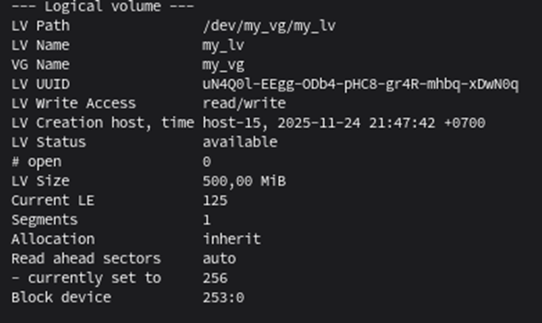
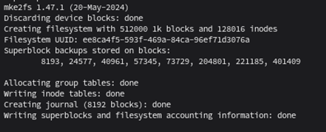
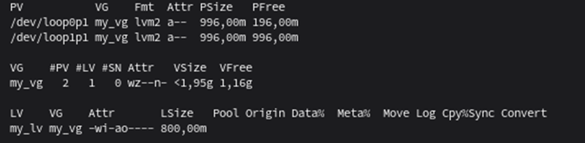
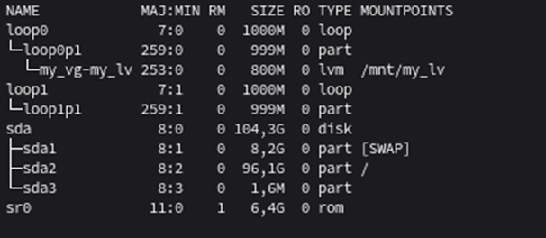

# Отчет по лабораторной работе №7  
**Работа с логическими томами LVM**

---

## Цель работы
Получить практические навыки по работе с логическими томами в ОС «Альт».

## Исходные данные
- Персональный компьютер/ноутбук (ЦП с поддержкой виртуализации, 8 ГБ ОЗУ, 100 ГБ свободного места на диске).
- Установленное ПО VirtualBox.
- Виртуальная машина «Альт Рабочая станция».

## Ход выполнения работы

### 1. Восстановление состояния системы
Восстановлено состояние системы из ранее сделанного снимка в VirtualBox.

### 2. Проверка и установка LVM
Выполнена проверка наличия LVM:
```bash
rpm -qa | grep lvm2
```
Пакет LVM не установлен. Выполнена установка:
```bash
apt-get update
apt-get install lvm2
```


### 3. Работа с дисками в `fdisk`
Добавлены два виртуальных диска. Выполнено создание разделов с типом `Linux LVM (8e)`:
```bash
fdisk /dev/loop0p1
fdisk /dev/loop1p1
```
Тип раздела изменен на `Linux LVM`.  


### 4-5. Создание разделов на обоих дисках
Для каждого диска созданы разделы с типом `8e (Linux LVM)`.

### 6. Создание физических томов (PV)
```bash
pvcreate /dev/loop2p1 /dev/loop3p1
```


### 7. Просмотр информации о физических томах
```bash
pvdisplay
```


### 8. Создание группы томов (VG)
```bash
vgcreate my_vg /dev/loop0p1 /dev/loop1p1
```


### 9. Просмотр информации о группе томов
```bash
vgdisplay
```


### 10. Создание логического тома (LV)
```bash
lvcreate -n my_lv -L 500M my_vg
```

### 11. Просмотр информации о логическом томе
```bash
lvdisplay
```


### 12. Форматирование логического тома
```bash
mkfs.ext4 /dev/my_vg/my_lv
```


### 13. Просмотр краткой информации о томах
```bash
pvs
vgs
lvs
```


### 14. Создание точки монтирования
```bash
mkdir /mnt/my_lv
```

### 15. Монтирование логического тома
```bash
mount /dev/my_vg/my_lv /mnt/my_lv
```

### 16. Проверка монтирования
```bash
df -h
lsblk
```


### 17. Настройка автозагрузки в `/etc/fstab`
Добавлена строка в файл `/etc/fstab`:
```
/dev/my_vg/my_lv /mnt/my_lv ext4 defaults 0 0
```

### 18. Проверка автоматического монтирования
После перезагрузки выполнена команда `df -h` - логический том автоматически смонтирован.

### 19. Расширение логического тома
```bash
lvextend -L +300M /dev/my_vg/my_lv
```
Размер увеличен с 500 МБ до 800 МБ.

### 20. Обновление файловой системы
```bash
resize2fs /dev/my_vg/my_lv
```

### 21. Проверка изменения размера
```bash
df -h
```
Раздел увеличен до 800 МБ.

### 22. Завершение работы
Работа завершена.

---

## Вывод
Лабораторная работа по работе с логическими томами LVM в операционной системе «Альт» показала преимущества гибкости и управляемости этой технологии. Использование LVM обеспечивает возможность динамического изменения размеров разделов и удобное управление хранилищем данных, что повышает эффективность администрирования и надежность системы.