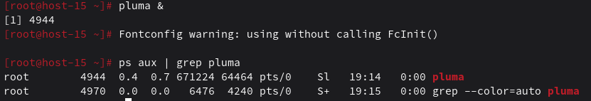

# Отчет по лабораторной работе №9
## Работа с процессами и службами в ОС «Альт»

**Выполнил:** Самсонов Кирилл Андреевич  
**Группа:** ИС-542 
**Дата:** 20.11.2025

---

### Цель работы
Получить практические навыки по работе с процессами и службами в операционной системе «Альт».

### Исходные данные
- Персональный компьютер с поддержкой виртуализации
- 8 ГБ ОЗУ, 100 ГБ свободного места на диске
- VirtualBox с виртуальной машиной «Альт Рабочая станция»

---

### Ход работы

#### 1. Работа с процессами текстового редактора pluma

**Выполненные действия:**
- Запущен текстовый редактор pluma
- Определен PID процесса pluma
- Проанализирована цепочка родительских процессов

**Команды:**
```bash
pluma &
ps -ef | grep pluma | grep -v grep
pstree -p | grep pluma
```

**Результаты:**
Запущен процесс pluma с PID. С помощью команды `ps -ef` найден PID процесса и его родительского процесса. Прослежена цепочка родительских процессов до init-процесса.




#### 2. Работа с rescue.target

**Выполненные действия:**
- Выполнен переход в rescue.target
- Просмотрено содержимое файла /etc/fstab
- Осуществлен возврат в graphical.target

**Команды:**
```bash
systemctl isolate rescue.target
cat /etc/fstab
systemctl isolate graphical.target
```

**Результаты:**
Успешно выполнен переход в аварийный режим. Просмотрено содержимое файла fstab, содержащего информацию о файловых системах. Возврат в графический режим выполнен без ошибок.


#### 3. Настройка multi-user.target как режима по умолчанию

**Выполненные действия:**
- Установлен multi-user.target как режим загрузки по умолчанию
- Выполнена перезагрузка системы
- Проверен текстовый режим загрузки
- Возвращен graphical.target как режим по умолчанию

**Команды:**
```bash
systemctl set-default multi-user.target
reboot
systemctl set-default graphical.target
reboot
```

**Результаты:**
После установки multi-user.target по умолчанию система загружается в текстовом режиме. После возврата graphical.target система снова загружается в графическом режиме.

#### 4. Отключение автозапуска сервиса sshd

**Выполненные действия:**
- Отключен автозапуск сервиса sshd
- Выполнена перезагрузка системы
- Проверен статус сервиса после загрузки

**Команды:**
```bash
systemctl disable sshd
reboot
systemctl status sshd
```

**Результаты:**
После отключения автозапуска и перезагрузки сервис sshd не запускается автоматически. Статус сервиса показывает, что он не активен.


#### 5. Запуск сервиса sshd

**Выполненные действия:**
- Запущен сервис sshd вручную
- Проверен его статус

**Команды:**
```bash
systemctl start sshd
systemctl status sshd
```

**Результаты:**
Сервис sshd успешно запущен вручную. Статус показывает, что сервис активен и работает.


#### 6. Запрет запуска сервиса sshd

**Выполненные действия:**
- Замаскирован сервис sshd (запрещен запуск)
- Проверен статус сервиса

**Команды:**
```bash
systemctl mask sshd
systemctl status sshd
```

**Результаты:**
Сервис sshd замаскирован. Попытки запуска сервиса блокируются. Статус показывает, что сервис замаскирован и не может быть запущен.


#### 7. Возврат прав запуска для sshd

**Выполненные действия:**
- Снята маска с сервиса sshd
- Включен автозапуск сервиса
- Выполнена перезагрузка для проверки
- Проверен статус сервиса после загрузки

**Команды:**
```bash
systemctl unmask sshd
systemctl enable sshd
reboot
systemctl status sshd
```

**Результаты:**
Маска с сервиса снята, автозапуск включен. После перезагрузки сервис sshd автоматически запускается и работает корректно.


#### 8. Планирование выключения системы

**Выполненные действия:**
- Запланировано выключение системы через 2 минуты
- Проверена очередь запланированных заданий

**Команды:**
```bash
echo "poweroff" | at now + 2 minutes
atq
```

**Результаты:**
Задание на выключение системы успешно запланировано. Команда `atq` показывает запланированное задание в очереди.


---

### Выводы

В ходе лабораторной работы были успешно освоены практические навыки работы с процессами и службами в операционной системе «Альт»:

1. **Мониторинг процессов** - получены навыки поиска и анализа цепочек процессов, определения PID и родительских процессов с помощью команд `ps` и `pstree`

2. **Управление целевыми режимами** - отработаны переходы между graphical.target и rescue.target, настройка режима загрузки по умолчанию с помощью systemctl

3. **Управление службами** - изучены операции включения/отключения автозапуска (`enable/disable`), запуска/остановки служб (`start/stop`), маскирования сервисов (`mask/unmask`)

4. **Планирование задач** - освоено использование планировщика at для отложенного выполнения команд

5. **Системное администрирование** - получен практический опыт работы с systemctl для управления системными службами, что является фундаментальным навыком для системного администратора

Лабораторная работа позволила закрепить важные компетенции в области управления процессами и службами, необходимые для обеспечения стабильной работы операционной системы и оптимизации ее производительности. Особую ценность представляет понимание механизмов управления службами через systemd и мониторинга системных процессов.