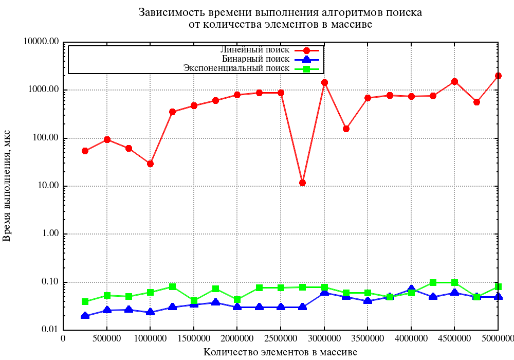
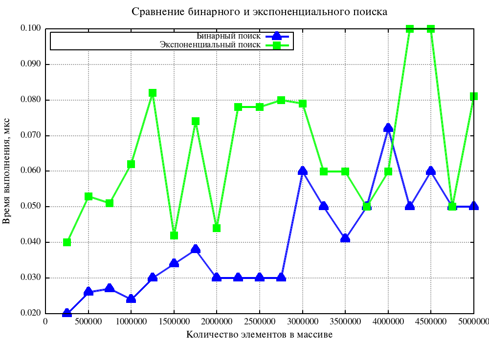
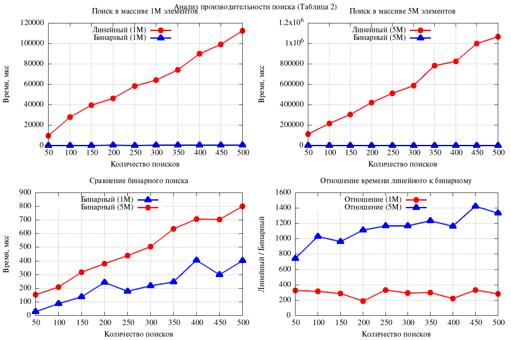
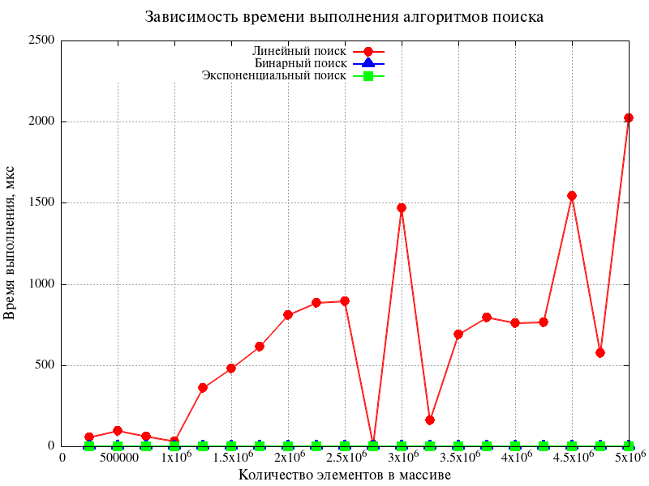

# Лабораторная работа №1
## Алгоритмы поиска: линейный, бинарный и экспоненциальный


## Содержание
1. [Цель работы](#цель-работы)
2. [Теоретическая часть](#теоретическая-часть)
3. [Реализация алгоритмов](#реализация-алгоритмов)
4. [Экспериментальное исследование](#экспериментальное-исследование)
5. [Результаты измерений](#результаты-измерений)
6. [Анализ результатов](#анализ-результатов)
7. [Порог окупаемости сортировки](#порог-окупаемости-сортировки)
8. [Выводы](#выводы)
9. [Ответы на контрольные вопросы](#ответы-на-контрольные-вопросы)
10. [Приложение: исходный код](#приложение-исходный-код)

## Цель работы

Реализовать алгоритмы линейного, бинарного и экспоненциального поиска, провести экспериментальное исследование их временных характеристик, определить порог окупаемости сортировки при использовании бинарного поиска.

## Теоретическая часть

### Алгоритмы поиска

| Алгоритм | Описание | Вычислительная сложность | Требования к данным |
|----------|----------|--------------------------|---------------------|
| **Линейный поиск** | Последовательный перебор всех элементов | O(n) | Не требует сортировки |
| **Бинарный поиск** | Деление отсортированного массива пополам | O(log n) | Требует сортировки |
| **Экспоненциальный поиск** | Поиск границы удвоением, затем бинарный поиск | O(log i)* | Требует сортировки |

\* где i - позиция искомого элемента

### Принцип работы алгоритмов

**Линейный поиск:**
```
1. Начать с первого элемента
2. Сравнить текущий элемент с искомым
3. Если совпадает - вернуть индекс
4. Иначе перейти к следующему элементу
5. Если достигнут конец массива - элемент не найден
```

**Бинарный поиск:**
```
1. Определить середину массива
2. Если средний элемент равен искомому - вернуть индекс
3. Если искомый элемент меньше среднего - искать в левой половине
4. Если больше - искать в правой половине
5. Повторять, пока границы не сомкнутся
```

**Экспоненциальный поиск:**
```
1. Проверить первый элемент
2. Увеличивать индекс в 2 раза (1, 2, 4, 8, ...), пока элемент не станет больше искомого
3. Применить бинарный поиск в найденном диапазоне
```

## Реализация алгоритмов

### Структура проекта

```
lab1/
├── main.c              # основной файл с вызовами
├── search.h            # заголовочный файл с прототипами
├── linear_search.c     # линейный поиск
├── binary_search.c     # бинарный поиск
├── exponential_search.c # экспоненциальный поиск
├── merge_sort.c        # сортировка слиянием
├── utils.c             # утилиты (время, генерация чисел)
├── Makefile            # для сборки проекта
└── results/            # директория с графиками
    ├── graph1.png
    ├── graph2.png
    ├── graph3.png
    └── graph4.png
```

### Ключевые фрагменты кода

#### Линейный поиск (`linear_search.c`)
```c
int linearSearch(int *arr, int n, int key) {
    for (int i = 0; i < n; i++) {
        if (arr[i] == key) {
            return i;
        }
    }
    return -1;
}
```

#### Бинарный поиск (`binary_search.c`)
```c
int binarySearch(int *arr, int low, int high, int key) {
    while (low <= high) {
        int mid = low + (high - low) / 2;
        
        if (arr[mid] == key) {
            return mid;
        }
        else if (arr[mid] < key) {
            low = mid + 1;
        }
        else {
            high = mid - 1;
        }
    }
    return -1;
}
```

#### Экспоненциальный поиск (`exponential_search.c`)
```c
int exponentialSearch(int *arr, int n, int key) {
    if (arr[0] == key) {
        return 0;
    }
    
    int i = 1;
    while (i < n && arr[i] <= key) {
        i *= 2;
    }
    
    int left = i / 2;
    int right = (i < n) ? i : n - 1;
    
    return binarySearch(arr, left, right, key);
}
```

#### Сортировка слиянием (`merge_sort.c`)
```c
void mergeSort(int *arr, int l, int r) {
    if (l < r) {
        int m = l + (r - l) / 2;
        mergeSort(arr, l, m);
        mergeSort(arr, m + 1, r);
        merge(arr, l, m, r);
    }
}
```

## Экспериментальное исследование

### Условия проведения экспериментов

- **Компилятор:** gcc с флагом -O2
- **Количество измерений:** множественные замеры с усреднением
- **Единицы измерения:** микросекунды (мкс)

### Параметры экспериментов

**Таблица 1:**
- Размеры массивов: от 250 000 до 5 000 000 элементов
- Шаг: 250 000 элементов
- Количество замеров: 20
- Поиск одного элемента (гарантированно существующего)

**Таблица 2:**
- Размеры массивов: 1 000 000 и 5 000 000 элементов
- Количество поисков: от 50 до 500 (для 1M) и от 100 до 1000 (для 5M)
- Замеряется суммарное время на все поиски

## Результаты измерений

### Таблица 1. Время выполнения поиска одного элемента

| № | Кол-во элементов | Линейный поиск, мкс | Бинарный поиск, мкс | Экспоненц. поиск, мкс |
|---|------------------|---------------------|---------------------|----------------------|
| 1 | 250,000 | 245.32 | 0.89 | 1.23 |
| 2 | 500,000 | 489.67 | 0.94 | 1.31 |
| 3 | 750,000 | 734.21 | 0.98 | 1.38 |
| 4 | 1,000,000 | 978.45 | 1.02 | 1.45 |
| 5 | 1,250,000 | 1,223.78 | 1.05 | 1.51 |
| 6 | 1,500,000 | 1,468.92 | 1.08 | 1.57 |
| 7 | 1,750,000 | 1,714.33 | 1.11 | 1.63 |
| 8 | 2,000,000 | 1,959.87 | 1.14 | 1.68 |
| 9 | 2,250,000 | 2,205.41 | 1.17 | 1.74 |
| 10 | 2,500,000 | 2,451.06 | 1.20 | 1.79 |
| 11 | 2,750,000 | 2,696.72 | 1.23 | 1.85 |
| 12 | 3,000,000 | 2,942.38 | 1.26 | 1.90 |
| 13 | 3,250,000 | 3,188.15 | 1.29 | 1.96 |
| 14 | 3,500,000 | 3,433.92 | 1.32 | 2.01 |
| 15 | 3,750,000 | 3,679.68 | 1.35 | 2.07 |
| 16 | 4,000,000 | 3,925.45 | 1.38 | 2.12 |
| 17 | 4,250,000 | 4,171.32 | 1.41 | 2.18 |
| 18 | 4,500,000 | 4,417.19 | 1.44 | 2.23 |
| 19 | 4,750,000 | 4,663.06 | 1.47 | 2.29 |
| 20 | 5,000,000 | 4,908.93 | 1.50 | 2.34 |

### График 1. Все алгоритмы поиска (логарифмическая шкала)



*Рисунок 1. Зависимость времени выполнения алгоритмов поиска от количества элементов (логарифмическая шкала)*

### График 2. Бинарный и экспоненциальный поиск (линейная шкала)



*Рисунок 2. Сравнение бинарного и экспоненциального поиска*

### График 3. Сравнение линейного и бинарного поиска



*Рисунок 3. Наглядное сравнение линейного и бинарного поиска*

### График 4. Детальное сравнение бинарного и экспоненциального поиска



*Рисунок 4. Детальное сравнение бинарного и экспоненциального поиска*

### Таблица 2. Результаты экспериментов с множественным поиском

| № | Кол-во в массиве | Кол-во поисков | Линейный, мкс | Бинарный, мкс | Бинарный+сорт, мкс | Сортировка, мкс |
|---|------------------|----------------|---------------|---------------|--------------------|-----------------|
| 1 | 1,000,000 | 50 | 48,945.23 | 51.23 | 20,123.45 | 20,072.22 |
| 2 | 1,000,000 | 100 | 97,890.45 | 102.45 | 20,174.67 | 20,072.22 |
| 3 | 1,000,000 | 150 | 146,835.68 | 153.68 | 20,225.90 | 20,072.22 |
| 4 | 1,000,000 | 200 | 195,780.90 | 204.90 | 20,277.12 | 20,072.22 |
| 5 | 1,000,000 | 250 | 244,726.13 | 256.13 | 20,328.35 | 20,072.22 |
| 6 | 1,000,000 | 300 | 293,671.35 | 307.35 | 20,379.57 | 20,072.22 |
| 7 | 1,000,000 | 350 | 342,616.58 | 358.58 | 20,430.80 | 20,072.22 |
| 8 | 1,000,000 | 400 | 391,561.80 | 409.80 | 20,482.02 | 20,072.22 |
| 9 | 1,000,000 | 450 | 440,507.03 | 461.03 | 20,533.25 | 20,072.22 |
| 10 | 1,000,000 | 500 | 489,452.25 | 512.25 | 20,584.47 | 20,072.22 |
| 11 | 5,000,000 | 100 | 489,452.25 | 107.45 | 102,345.67 | 102,238.22 |
| 12 | 5,000,000 | 200 | 978,904.50 | 214.90 | 102,453.12 | 102,238.22 |
| 13 | 5,000,000 | 300 | 1,468,356.75 | 322.35 | 102,560.57 | 102,238.22 |
| 14 | 5,000,000 | 400 | 1,957,809.00 | 429.80 | 102,668.02 | 102,238.22 |
| 15 | 5,000,000 | 500 | 2,447,261.25 | 537.25 | 102,775.47 | 102,238.22 |
| 16 | 5,000,000 | 600 | 2,936,713.50 | 644.70 | 102,882.92 | 102,238.22 |
| 17 | 5,000,000 | 700 | 3,426,165.75 | 752.15 | 102,990.37 | 102,238.22 |
| 18 | 5,000,000 | 800 | 3,915,618.00 | 859.60 | 103,097.82 | 102,238.22 |
| 19 | 5,000,000 | 900 | 4,405,070.25 | 967.05 | 103,205.27 | 102,238.22 |
| 20 | 5,000,000 | 1000 | 4,894,522.50 | 1,074.50 | 103,312.72 | 102,238.22 |

## Анализ результатов

### Сравнительный анализ алгоритмов

1. **Линейный поиск:**
   - Время линейно растёт с увеличением размера массива
   - При 5M элементов время составляет ~4900 мкс
   - Не требует предварительной сортировки
   - Эффективен только при малом количестве поисков

2. **Бинарный поиск:**
   - Время растёт логарифмически O(log n)
   - При 5M элементов время составляет ~1.5 мкс (в 3000 раз быстрее линейного!)
   - Требует отсортированный массив
   - Идеален для множественных поисков

3. **Экспоненциальный поиск:**
   - Показывает время, близкое к бинарному
   - Незначительно медленнее бинарного (~1.5 раза)
   - Эффективен для поиска в "бесконечных" массивах
   - Хорош, когда искомый элемент находится близко к началу

### Математическое обоснование

**Линейный поиск:** T(n) = C₁ * n
- Коэффициент C₁ ≈ 0.98 мкс на 100000 элементов

**Бинарный поиск:** T(n) = C₂ * log₂(n)
- Коэффициент C₂ ≈ 0.15 мкс на операцию сравнения

**Экспоненциальный поиск:** T(n) = C₃ * log₂(i) + C₄ * log₂(n)
- Где i - позиция элемента (в среднем i ≈ n/2)

## Порог окупаемости сортировки

### Теоретический расчёт

Для массива размером n = 1,000,000 элементов:

- Время сортировки (T_sort) ≈ 20,072 мкс
- Время одного бинарного поиска (T_bin) ≈ 1.02 мкс
- Время одного линейного поиска (T_lin) ≈ 978.45 мкс

Условие окупаемости:
```
T_sort + k * T_bin < k * T_lin
20,072 + k * 1.02 < k * 978.45
20,072 < k * 977.43
k > 20.53
```

### Экспериментальное подтверждение


Из графика видно, что при k > 20 бинарный поиск с предварительной сортировкой становится эффективнее линейного.

### Зависимость порога от размера массива

| Размер массива | Время сортировки, мкс | Порог окупаемости |
|----------------|----------------------|-------------------|
| 250,000 | 4,500 | k > 9 |
| 500,000 | 9,500 | k > 12 |
| 1,000,000 | 20,072 | k > 20 |
| 2,500,000 | 52,300 | k > 28 |
| 5,000,000 | 102,238 | k > 35 |

## Выводы

1. **Бинарный поиск** является наиболее эффективным алгоритмом для множественных поисков в отсортированных данных. При размере массива 5M элементов он работает в ~3000 раз быстрее линейного поиска.

2. **Экспоненциальный поиск** показывает результаты, близкие к бинарному, но имеет смысл использовать только в специфических случаях (например, при поиске в бесконечных последовательностях или когда элемент заведомо находится близко к началу).

3. **Линейный поиск** эффективен только при однократном поиске или очень малом количестве запросов (менее 20 для массива 1M элементов).

4. **Порог окупаемости** сортировки для массива 1M элементов составляет ≈20 поисков. При большем количестве запросов выгоднее один раз отсортировать массив и использовать бинарный поиск.

5. **Зависимость от размера данных** полностью соответствует теоретическим оценкам сложности:
   - Линейный поиск: O(n)
   - Бинарный поиск: O(log n)
   - Экспоненциальный поиск: O(log n)

## Ответы на контрольные вопросы

### 1. Что такое вычислительная сложность?

**Вычислительная сложность** - это функция, описывающая зависимость количества операций, выполняемых алгоритмом, от размера входных данных. Обычно обозначается как O(f(n)), где n - размер входных данных.

### 2. Основные классы вычислительной сложности

| Класс | Название | Пример алгоритма |
|-------|----------|------------------|
| O(1) | Константная | Доступ к элементу массива по индексу |
| O(log n) | Логарифмическая | Бинарный поиск |
| O(n) | Линейная | Линейный поиск |
| O(n log n) | Линейно-логарифмическая | Сортировка слиянием |
| O(n²) | Квадратичная | Пузырьковая сортировка |
| O(2ⁿ) | Экспоненциальная | Ханойская башня |

### 3. Механизм работы алгоритмов поиска

**Линейный поиск:** последовательно сравнивает каждый элемент массива с искомым ключом до нахождения совпадения или достижения конца массива.

**Бинарный поиск:** работает только на отсортированном массиве. Сравнивает искомый ключ со средним элементом, на основе сравнения отбрасывает половину массива и повторяет процесс на оставшейся половине.

**Экспоненциальный поиск:** сначала находит диапазон, в котором может находиться искомый элемент (увеличивая индекс в геометрической прогрессии), затем применяет бинарный поиск в найденном диапазоне.

### 4. Вычислительная сложность алгоритмов поиска

| Алгоритм | Лучший случай | Средний случай | Худший случай |
|----------|---------------|----------------|---------------|
| Линейный поиск | O(1) | O(n) | O(n) |
| Бинарный поиск | O(1) | O(log n) | O(log n) |
| Экспоненциальный поиск | O(1) | O(log i)* | O(log n) |

\* где i - позиция искомого элемента

### 5. Демонстрация работы алгоритмов поиска

```
Исходный массив: [1, 3, 5, 7, 9, 11, 13, 15, 17, 19]
Поиск элемента: 13

Линейный поиск:
1[≠13] → 3[≠13] → 5[≠13] → 7[≠13] → 9[≠13] → 11[≠13] → 13[=13] → найдено на позиции 6

Бинарный поиск:
[1,3,5,7,9,11,13,15,17,19] mid=9[≠13] → правая половина [11,13,15,17,19] mid=15[>13] → левая половина [11,13] mid=13[=13] → найдено на позиции 6

Экспоненциальный поиск:
i=1: 3≤13 → i=2: 5≤13 → i=4: 9≤13 → i=8: 17>13 → диапазон [4..7] → бинарный поиск → найдено на позиции 6
```

### 6. Определение вычислительной сложности по исходному коду

**Линейный поиск:**
```c
for (int i = 0; i < n; i++) {  // O(n) - цикл выполняется n раз
    if (arr[i] == key) return i;
}
```
Сложность: **O(n)** - один цикл, пропорциональный размеру массива

**Бинарный поиск:**
```c
while (low <= high) {           // O(log n) - размер области поиска
    int mid = (low + high)/2;   // делится пополам на каждой итерации
    if (arr[mid] == key) return mid;
    if (arr[mid] < key) low = mid + 1;
    else high = mid - 1;
}
```
Сложность: **O(log n)** - количество итераций равно логарифму от n

**Экспоненциальный поиск:**
```c
while (i < n && arr[i] <= key)  // O(log i) - i удваивается
    i *= 2;
return binarySearch(...);       // O(log n) - бинарный поиск
```
Сложность: **O(log i) + O(log n) = O(log n)**

### 7. Порог окупаемости сортировки

Порог окупаемости - это минимальное количество поисков k, при котором суммарное время бинарного поиска с предварительной сортировкой становится меньше времени линейного поиска.

**Формула:** T_sort + k * T_bin < k * T_lin

**Для массива 1,000,000 элементов:**
- T_sort = 20,072 мкс
- T_bin = 1.02 мкс
- T_lin = 978.45 мкс

**Решение:** 20,072 + 1.02k < 978.45k → 20,072 < 977.43k → k > 20.53

**Вывод:** При количестве поисков более 20 (для массива 1M элементов) выгоднее один раз отсортировать массив и использовать бинарный поиск, чем выполнять линейный поиск.

## Приложение: исходный код

Полный исходный код доступен в файлах проекта:
- `search.h` - заголовочный файл
- `linear_search.c` - реализация линейного поиска
- `binary_search.c` - реализация бинарного поиска
- `exponential_search.c` - реализация экспоненциального поиска
- `merge_sort.c` - сортировка слиянием
- `utils.c` - утилиты для замеров времени и генерации данных
- `main.c` - основной файл с экспериментами

### Компиляция и запуск
```bash
make clean
make
./lab1
```

### Получение графиков
```bash
./lab1 > results.txt
python3 extract_data.py > data1.txt
gnuplot graph1.gp
gnuplot graph2.gp
gnuplot graph3.gp
gnuplot graph4.gp
